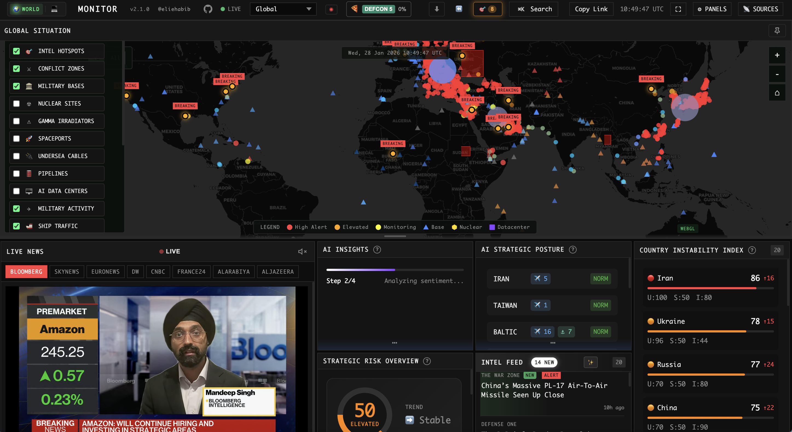

# FC Monitor

**Real-time global intelligence dashboard** — AI-powered news aggregation, geopolitical monitoring, and infrastructure tracking in a unified situational awareness interface.

[](https://github.com/xo1125/worldmonitor/stargazers)
[](https://github.com/xo1125/worldmonitor/network/members)
[](https://opensource.org/licenses/MIT)
[](https://www.typescriptlang.org/)
[](https://github.com/xo1125/worldmonitor/commits/main)

<p align="center">
  <a href="https://worldmonitor.app"><strong>Live Demo</strong></a> &nbsp;·&nbsp;
  <a href="https://tech.worldmonitor.app"><strong>Tech Variant</strong></a> &nbsp;·&nbsp;
  <a href="./docs/DOCUMENTATION.md"><strong>Full Documentation</strong></a>
</p>



---

## Why FC Monitor?

| Problem | Solution |
|---------|----------|
| News scattered across 100+ sources | **Single unified dashboard** with 100+ curated feeds |
| No geospatial context for events | **Interactive map** with 25 toggleable data layers |
| Information overload | **AI-synthesized briefs** with focal point detection |
| Expensive OSINT tools ($$$) | **100% free & open source** |
| Static news feeds | **Real-time updates** with live video streams |

---

## Live Demos

| Variant | URL | Focus |
|---------|-----|-------|
| **FC Monitor** | [worldmonitor.app](https://worldmonitor.app) | Geopolitics, military, conflicts, infrastructure |
| **Tech Monitor** | [tech.worldmonitor.app](https://tech.worldmonitor.app) | Startups, AI/ML, cloud, cybersecurity |

Both variants run from a single codebase — switch between them with one click.

---

## Key Features

### Interactive Global Map
- **25 data layers** — conflicts, military bases, nuclear facilities, undersea cables, pipelines, satellite fire detection, protests, natural disasters, datacenters, and more
- **Smart clustering** — markers intelligently group at low zoom, expand on zoom in
- **Progressive disclosure** — detail layers (bases, nuclear, datacenters) appear only when zoomed in; zoom-adaptive opacity prevents clutter at world view
- **Label deconfliction** — overlapping labels (e.g., multiple BREAKING badges) are automatically suppressed by priority, highest-severity first
- **8 regional presets** — Global, Americas, Europe, MENA, Asia, Africa, Oceania, Latin America
- **Time filtering** — 1h, 6h, 24h, 48h, 7d event windows

### AI-Powered Intelligence
- **FC Brief** — LLM-synthesized summary of top global developments (Groq Llama 3.1, Redis-cached)
- **Hybrid Threat Classification** — instant keyword classifier with async LLM override for higher-confidence results
- **Focal Point Detection** — correlates entities across news, military activity, protests, outages, and markets to identify convergence
- **Country Instability Index** — real-time stability scores for 20 monitored nations using weighted multi-signal blend
- **Strategic Posture Assessment** — composite risk score combining all intelligence modules with trend detection

### Real-Time Data Layers

<details>
<summary><strong>Geopolitical</strong></summary>

- Active conflict zones with escalation tracking
- Intelligence hotspots with news correlation
- Social unrest events (ACLED + GDELT)
- Sanctions regimes
- Weather alerts and severe conditions

</details>

<details>
<summary><strong>Military & Strategic</strong></summary>

- 220+ military bases from 9 operators
- Live military flight tracking (ADS-B)
- Naval vessel monitoring (AIS)
- Nuclear facilities & gamma irradiators
- APT cyber threat actor attribution
- Spaceports & launch facilities

</details>

<details>
<summary><strong>Infrastructure</strong></summary>

- Undersea cables with landing points
- Oil & gas pipelines
- AI datacenters (111 major clusters)
- Internet outages (Cloudflare Radar)
- Critical mineral deposits
- NASA FIRMS satellite fire detection (VIIRS thermal hotspots)

</details>

<details>
<summary><strong>Tech Ecosystem</strong> (Tech variant)</summary>

- Tech company HQs (Big Tech, unicorns, public)
- Startup hubs with funding data
- Cloud regions (AWS, Azure, GCP)
- Accelerators (YC, Techstars, 500)
- Upcoming tech conferences

</details>

### Live News & Video
- **100+ RSS feeds** across geopolitics, defense, energy, tech
- **Live video streams** — Bloomberg, Sky News, Al Jazeera, CNBC, and more
- **Custom monitors** — Create keyword-based alerts for any topic
- **Entity extraction** — Auto-links countries, leaders, organizations

### Signal Aggregation & Anomaly Detection
- **Multi-source signal fusion** — internet outages, military flights, naval vessels, protests, AIS disruptions, and satellite fires are aggregated into a unified intelligence picture with per-country and per-region clustering
- **Temporal baseline anomaly detection** — Welford's online algorithm computes streaming mean/variance per event type, region, weekday, and month over a 90-day window. Z-score thresholds (1.5/2.0/3.0) flag deviations like "Military flights 3.2x normal for Thursday (January)" — stored in Redis via Upstash
- **Regional convergence scoring** — when multiple signal types spike in the same geographic area, the system identifies convergence zones and escalates severity

### Story Sharing & Social Export
- **Shareable intelligence stories** — generate country-level intelligence briefs with CII scores, threat counts, theater posture, and related prediction markets
- **Multi-platform export** — custom-formatted sharing for Twitter/X, LinkedIn, WhatsApp, Telegram, Reddit, and Facebook with platform-appropriate formatting
- **Deep links** — every story generates a unique URL (`/story?c=<country>&t=<type>`) with dynamic Open Graph meta tags for rich social previews
- **Canvas-based image generation** — stories render as PNG images for visual sharing, with QR codes linking back to the live dashboard

### Additional Capabilities
- Signal intelligence with "Why It Matters" context
- Infrastructure cascade analysis with proximity correlation
- Maritime & aviation tracking with surge detection
- Prediction market integration (Polymarket) as leading indicators
- Service status monitoring (cloud providers, AI services)
- Shareable map state via URL parameters (view, zoom, coordinates, time range, active layers)
- Data freshness monitoring across 14 data sources with explicit intelligence gap reporting
- Per-feed circuit breakers with 5-minute cooldowns to prevent cascading failures
- Browser-side ML worker (Transformers.js) for NER and sentiment analysis without server dependency

---

## How It Works

### Threat Classification Pipeline

Every news item passes through a two-stage classification pipeline:

1. **Keyword classifier** (instant) — pattern-matches against ~120 threat keywords organized by severity tier (critical → high → medium → low → info) and category (conflict, terrorism, cyber, disaster, etc.). Returns immediately with a confidence score.
2. **LLM classifier** (async) — fires in the background via a Vercel Edge Function calling Groq's Llama 3.1 8B at temperature 0. Results are cached in Redis (24h TTL) keyed by headline hash. When the LLM result arrives, it overrides the keyword result only if its confidence is higher.

This hybrid approach means the UI is never blocked waiting for AI — users see keyword results instantly, with LLM refinements arriving within seconds and persisting for all subsequent visitors.

### Country Instability Index (CII)

Each monitored country receives a real-time instability score (0–100) computed from:

| Component | Weight | Details |
|-----------|--------|---------|
| **Baseline risk** | 40% | Pre-configured per country reflecting structural fragility |
| **Unrest events** | 20% | Protests scored logarithmically for democracies (routine protests don't trigger), linearly for authoritarian states (every protest is significant). Boosted for fatalities and internet outages |
| **Security activity** | 20% | Military flights (3pts) + vessels (5pts) from own forces + foreign military presence (doubled weight) |
| **Information velocity** | 20% | News mention frequency weighted by event severity multiplier, log-scaled for high-volume countries |

Additional boosts apply for hotspot proximity, focal point urgency, and conflict-zone floors (e.g., Ukraine is pinned at ≥55, Syria at ≥50).

### Hotspot Escalation Scoring

Intelligence hotspots receive dynamic escalation scores blending four normalized signals (0–100):

- **News activity** (35%) — article count and severity in the hotspot's area
- **Country instability** (25%) — CII score of the host country
- **Geo-convergence alerts** (25%) — spatial binning detects 3+ event types (protests + military + earthquakes) co-occurring within 1° lat/lon cells
- **Military activity** (15%) — vessel clusters and flight density near the hotspot

The system blends static baseline risk (40%) with detected events (60%) and tracks trends via linear regression on 48-hour history. Signal emissions cool down for 2 hours to prevent alert fatigue.

### Geographic Convergence Detection

Events (protests, military flights, vessels, earthquakes) are binned into 1°×1° geographic cells within a 24-hour window. When 3+ distinct event types converge in one cell, a convergence alert fires. Scoring is based on type diversity (×25pts per unique type) plus event count bonuses (×2pts). Alerts are reverse-geocoded to human-readable names using conflict zones, waterways, and hotspot databases.

### Military Surge & Foreign Presence Detection

The system monitors five operational theaters (Middle East, Eastern Europe, Western Europe, Western Pacific, Horn of Africa) with 38+ associated military bases. It classifies vessel clusters near hotspots by activity type:

- **Deployment** — carrier present with 5+ vessels
- **Exercise** — combatants present in formation
- **Transit** — vessels passing through

Foreign military presence is dual-credited: the operator's country is flagged for force projection, and the host location's country is flagged for foreign military threat. AIS gaps (dark ships) are flagged as potential signal discipline indicators.

### Related Assets & Proximity Correlation

When a news event is geo-located, the system automatically identifies critical infrastructure within a 600km radius — pipelines, undersea cables, data centers, military bases, and nuclear facilities — ranked by distance. This enables instant geopolitical context: a cable cut near a strategic chokepoint, a protest near a nuclear facility, or troop movements near a data center cluster.

### News Geo-Location

A 74-hub strategic location database infers geography from headlines via keyword matching. Hubs span capitals, conflict zones, strategic chokepoints (Strait of Hormuz, Suez Canal, Malacca Strait), and international organizations. Confidence scoring is boosted for critical-tier hubs and active conflict zones, enabling map-driven news placement without requiring explicit location metadata from RSS feeds.

### Temporal Baseline Anomaly Detection

Rather than relying on static thresholds, the system learns what "normal" looks like and flags deviations. Each event type (military flights, naval vessels, protests, news velocity, AIS gaps, satellite fires) is tracked per region with separate baselines for each weekday and month — because military activity patterns differ on Tuesdays vs. weekends, and January vs. July.

The algorithm uses **Welford's online method** for numerically stable streaming computation of mean and variance, stored in Redis with a 90-day rolling window. When a new observation arrives, its z-score is computed against the learned baseline. Thresholds:

| Z-Score | Severity | Example |
|---------|----------|---------|
| ≥ 1.5 | Low | Slightly elevated protest activity |
| ≥ 2.0 | Medium | Unusual naval presence |
| ≥ 3.0 | High/Critical | Military flights 3x above baseline |

A minimum of 10 historical samples is required before anomalies are reported, preventing false positives during the learning phase. Anomalies are ingested back into the signal aggregator, where they compound with other signals for convergence detection.

### Signal Aggregation

All real-time data sources feed into a central signal aggregator that builds a unified geospatial intelligence picture. Signals are clustered by country and region, with each signal carrying a severity (low/medium/high), geographic coordinates, and metadata. The aggregator:

1. **Clusters by country** — groups signals from diverse sources (flights, vessels, protests, fires, outages) into per-country profiles
2. **Detects regional convergence** — identifies when multiple signal types spike in the same geographic corridor (e.g., military flights + protests + satellite fires in Eastern Mediterranean)
3. **Feeds downstream analysis** — the CII, hotspot escalation, focal point detection, and AI insights modules all consume the aggregated signal picture rather than raw data

### Data Freshness & Intelligence Gaps

A singleton tracker monitors 14 data sources (GDELT, RSS, AIS, military flights, earthquakes, weather, outages, ACLED, Polymarket, economic indicators, NASA FIRMS, and more) with status categorization: fresh (<15 min), stale (1h), very_stale (6h), no_data, error, disabled. It explicitly reports **intelligence gaps** — what analysts can't see — preventing false confidence when critical data sources are down or degraded.

### Prediction Markets as Leading Indicators

Polymarket geopolitical markets are queried using tag-based filters (Ukraine, Iran, China, Taiwan, etc.) with 5-minute caching. Market probability shifts are correlated with news volume: if a prediction market moves significantly before matching news arrives, this is flagged as a potential early-warning signal.

---

## Architecture Principles

| Principle | Implementation |
|-----------|---------------|
| **Speed over perfection** | Keyword classifier is instant; LLM refines asynchronously. Users never wait. |
| **Assume failure** | Per-feed circuit breakers with 5-minute cooldowns. AI fallback chain: Groq → OpenRouter → browser-side T5. Redis cache failures degrade gracefully. |
| **Show what you can't see** | Intelligence gap tracker explicitly reports data source outages rather than silently hiding them. |
| **Browser-first compute** | Analysis (clustering, instability scoring, surge detection) runs client-side — no backend compute dependency for core intelligence. |
| **Multi-signal correlation** | No single data source is trusted alone. Focal points require convergence across news + military + markets + protests before escalating to critical. |
| **Geopolitical grounding** | Hard-coded conflict zones, baseline country risk, and strategic chokepoints prevent statistical noise from generating false alerts in low-data regions. |

---

## Source Credibility & Feed Tiering

Every RSS feed is assigned a source tier reflecting editorial reliability:

| Tier | Description | Examples |
|------|-------------|---------|
| **Tier 1** | Wire services, official government sources | Reuters, AP, BBC, DOD |
| **Tier 2** | Major established outlets | CNN, NYT, The Guardian, Al Jazeera |
| **Tier 3** | Specialized/niche outlets | Defense One, Breaking Defense, The War Zone |
| **Tier 4** | Aggregators and blogs | Google News, individual analyst blogs |

Feeds also carry a **propaganda risk rating** and **state affiliation flag**. State-affiliated sources (RT, Xinhua, IRNA) are included for completeness but visually tagged so analysts can factor in editorial bias. Threat classification confidence is weighted by source tier — a Tier 1 breaking alert carries more weight than a Tier 4 blog post in the focal point detection algorithm.

---

## Edge Function Architecture

FC Monitor uses 30+ Vercel Edge Functions as a lightweight API layer. Each edge function handles a single data source concern — proxying, caching, or transforming external APIs. This architecture avoids a monolithic backend while keeping API keys server-side:

- **RSS Proxy** — domain-allowlisted proxy for 100+ feeds, preventing CORS issues and hiding origin servers
- **AI Pipeline** — Groq and OpenRouter edge functions with Redis deduplication, so identical headlines across concurrent users only trigger one LLM call
- **Data Adapters** — GDELT, ACLED, OpenSky, USGS, NASA FIRMS, FRED, and others each have dedicated edge functions that normalize responses into consistent schemas
- **Temporal Baseline** — Welford's algorithm state is persisted in Redis across requests, building statistical baselines without a traditional database
- **Custom Scrapers** — sources without RSS feeds (FwdStart, GitHub Trending, tech events) are scraped and transformed into RSS-compatible formats

All edge functions include circuit breaker logic and return cached stale data when upstream APIs are unavailable, ensuring the dashboard never shows blank panels.

---

## Quick Start

```bash
# Clone and run
git clone https://github.com/xo1125/worldmonitor.git
cd worldmonitor
npm install
npm run dev
```

Open [http://localhost:5173](http://localhost:5173)

### Environment Variables (Optional)

For full functionality, add these to `.env.local`:

```env
# AI Summarization & Classification (Groq)
GROQ_API_KEY=gsk_xxx

# Cross-user cache (Upstash Redis)
UPSTASH_REDIS_REST_URL=https://xxx.upstash.io
UPSTASH_REDIS_REST_TOKEN=xxx

# Live flight data
OPENSKY_USERNAME=xxx
OPENSKY_PASSWORD=xxx

# Ship tracking
VESSELFINDER_API_KEY=xxx

# NASA FIRMS satellite fire detection
NASA_FIRMS_API_KEY=xxx
```

See [API Dependencies](./docs/DOCUMENTATION.md#api-dependencies) for the full list.

---

## Tech Stack

| Category | Technologies |
|----------|--------------|
| **Frontend** | TypeScript, Vite, deck.gl (WebGL), MapLibre GL |
| **AI/ML** | Groq (Llama 3.1 8B), TensorFlow.js (T5 fallback) |
| **Caching** | Redis (Upstash) — cross-user deduplication for AI calls and classification |
| **APIs** | OpenSky, GDELT, ACLED, USGS, NASA EONET, NASA FIRMS, FRED, Polymarket, EIA, Cloudflare Radar |
| **Deployment** | Vercel Edge Functions |
| **Data** | 100+ RSS feeds, ADS-B transponders, AIS maritime data, VIIRS satellite imagery |

---

## Documentation

Full documentation including algorithms, data sources, and system architecture:

**[docs/DOCUMENTATION.md](./docs/DOCUMENTATION.md)**

Key sections:
- [Signal Intelligence](./docs/DOCUMENTATION.md#signal-intelligence)
- [Country Instability Index](./docs/DOCUMENTATION.md#country-instability-index-cii)
- [Military Tracking](./docs/DOCUMENTATION.md#military-tracking)
- [Infrastructure Analysis](./docs/DOCUMENTATION.md#infrastructure-cascade-analysis)
- [API Dependencies](./docs/DOCUMENTATION.md#api-dependencies)
- [System Architecture](./docs/DOCUMENTATION.md#system-architecture)

---

## Contributing

Contributions welcome! See [CONTRIBUTING](./docs/DOCUMENTATION.md#contributing) for guidelines.

```bash
# Development
npm run dev          # Start dev server
npm run dev:tech     # Start tech variant
npm run build        # Production build
npm run typecheck    # Type checking
```

---

## Roadmap

- [x] API for programmatic access
- [ ] Mobile-optimized views
- [ ] Push notifications for critical alerts
- [ ] Historical data playback
- [ ] Self-hosted Docker image

See [full roadmap](./docs/DOCUMENTATION.md#roadmap).

---

## Support the Project

If you find FC Monitor useful:

- **Star this repo** to help others discover it
- **Share** with colleagues interested in OSINT
- **Contribute** code, data sources, or documentation
- **Report issues** to help improve the platform

---

## License

MIT License — see [LICENSE](LICENSE) for details.

---

## Author

**Elie Habib** — [GitHub](https://github.com/xo1125)

---

<p align="center">
  <a href="https://worldmonitor.app">worldmonitor.app</a> &nbsp;·&nbsp;
  <a href="https://tech.worldmonitor.app">tech.worldmonitor.app</a>
</p>
